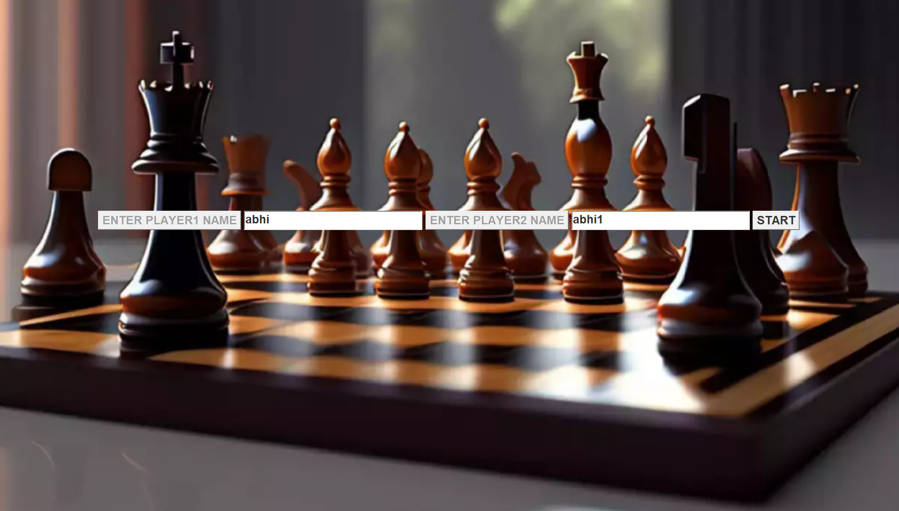
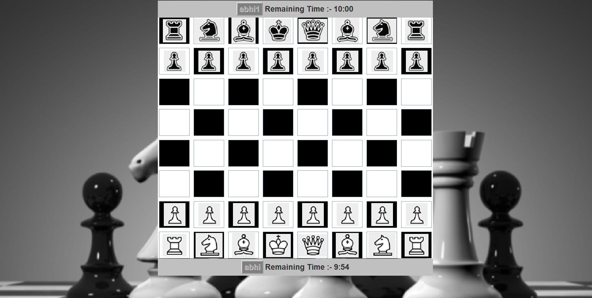
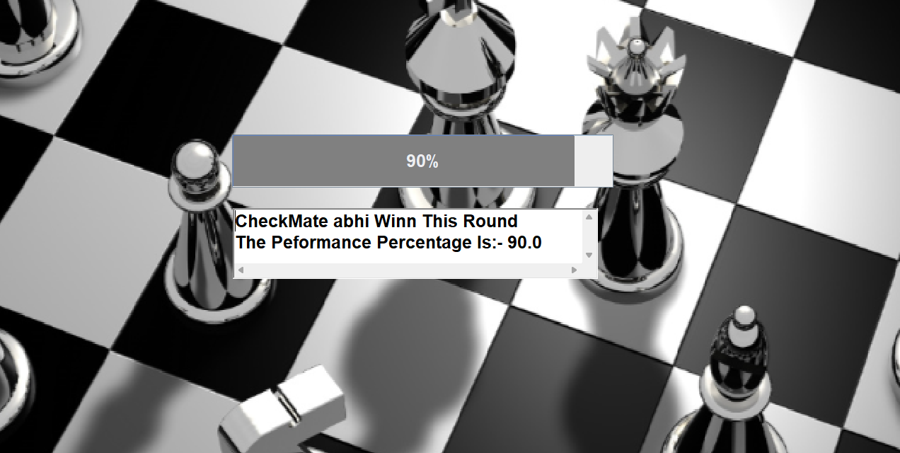

# ♟️ ChessMasterEngine(StrategicChess) — Pure Java Chess Logic

**ChessMasterEngine** is a handcrafted chess engine built entirely in Java, featuring a clean user interface and fully custom game logic. From move validation to winner detection, every aspect is coded from scratch — no external libraries used.

---

## 🎮 Game Features

- 👥 **Player Input Panel**  
  Enter names for both players before starting the match.

- 🧠 **Custom Chess Logic**  
  All rules, moves, and validations are implemented manually using Java conditions.

- 🖥️ **Game Board UI**  
  Interactive chess grid built with Java Swing — smooth and responsive.

- 🏆 **Winner Panel**  
  Displays the winner’s name and calculates accuracy based on move efficiency.

---

## 🖼️ Visual Preview

### 👤 Player Info Window

  
*Players enter their names before launching the game.*

---

### 🎲 Chess Game Window

  
*Play chess with full rule enforcement and smooth piece movement.*

---

### 🏁 Result Window

  
*Winner’s name and accuracy percentage are displayed at the end.*

---

## 🛠️ Tech Stack

| Layer       | Technology     |
|-------------|----------------|
| UI          | Java Swing     |
| Logic       | Pure Java (no libraries) |
| Input       | Text Fields & Buttons |
| Graphics    | JPanel, JLabel |

---

## 🚀 Getting Started

To run locally:

```bash
# Clone the repository
git clone https://github.com/abhi041540/ChessMasterEngine.git
cd ChessMasterEngine

# Compile and run
javac Main.java
java Main
